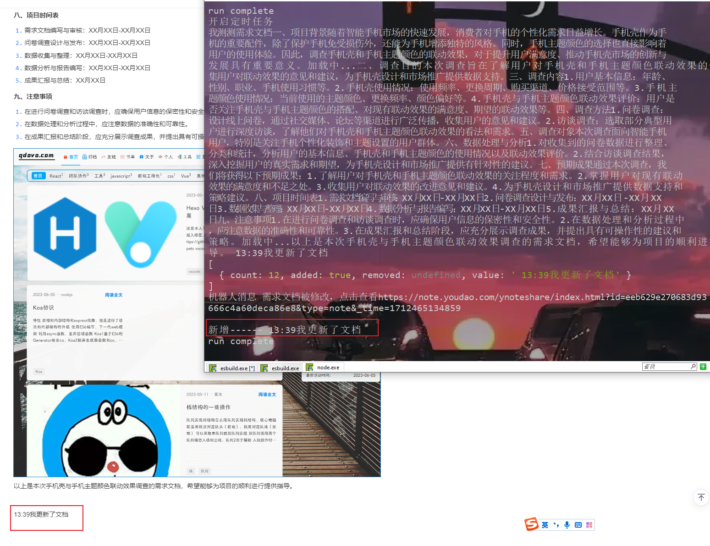

# robot-notice

## 介绍

这是一个什么项目？多年前在某大厂上班时，为团队搭建的一个基础设施吧，这个项目主要实现两个功能

1. git仓库的webhooks被触发时调用我司机器人的接口，通知到群里

2. 爬虫爬取产品经理写的需求文档，通过前后diff比对产品对需求文档的增删改，定时任务轮询，然后调用机器人的hook往项目群里发通知，同学们再也不担心需求文档被篡改了

## 示例


## 安装

```bash
npm i
# npm install puppeteer --registry https://registry.npm.taobao.org # 淘宝镜像换了地址
npm install puppeteer --registry https://registry.npmmirror.com
```

## 使用 & 开发

在根目录下的config.js填写好爬虫的地址，爬取时间规则，机器人hooks api和git webhooks的相关参数

```bash
npm run dev
```

<span style="color: red;font-size: 18px;">如果你监听的文档在指定的时间规则内被更新了，就能爬取到数据如下</span>



## 生产环境运行服务

低版本不支持fs.promises，所以需要指定node版本

```bash
# 启动，只需执行一次
pm2 start --interpreter ~/.nvm/versions/node/v12.19.0/bin/node --name robot-notice npm -- run start

# 重启
pm2 restart robot-notice
```

1. 如果你需要git hooks的消息通知功能，本项目会运行在5900端口，将服务器ip:5900填写在你的git仓库的webhooks设置中，当其触发时会post调用本项目下的接口
2. 如果你需要爬虫比对数据并且通知，机器人。那填写config.spider即可。启动后即刻开始爬虫轮询.如果不需要，设置config.js中的spider.enable = false

轮询时间支持递归格式和cron风格

递归格式：即配置config.js中的spier.rule为对象，其中属性支持month ，dayOfWeek ，dayOfMonth ，hour ，minute ，second 等
cron格式: 将rule设置为字符串，如：'30 * * * * *'， 代表每30秒执行

通配符说明：

*  *  *  *  *  *
┬ ┬ ┬ ┬ ┬ ┬
│ │ │ │ │  |
│ │ │ │ │ └ day of week (0 - 7) (0 or 7 is Sun)
│ │ │ │ └───── month (1 - 12)
│ │ │ └────────── day of month (1 - 31)
│ │ └─────────────── hour (0 - 23)
│ └──────────────────── minute (0 - 59)
└───────────────────────── second (0 - 59, OPTIONAL)